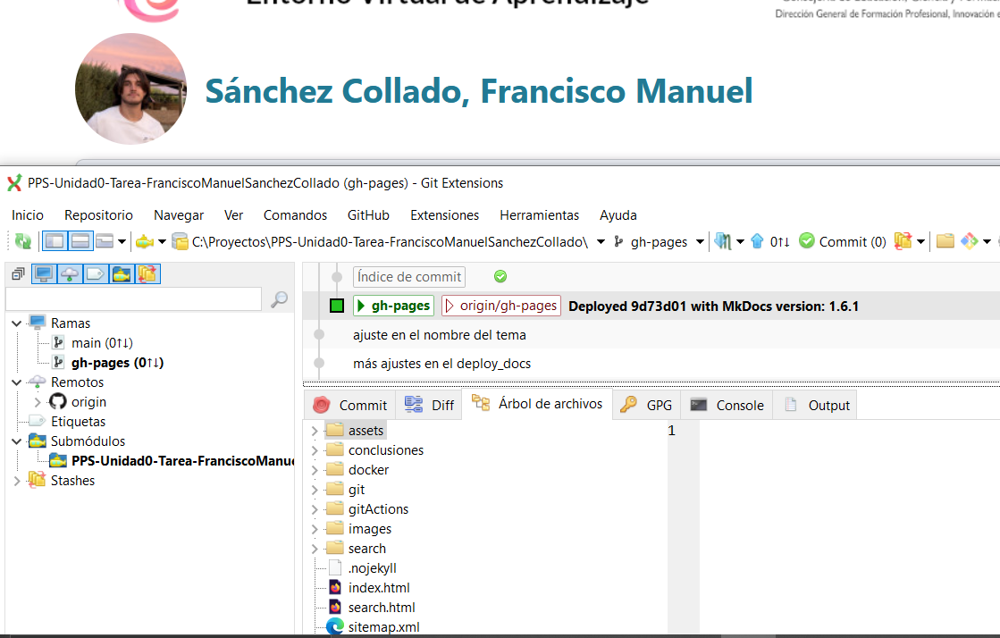
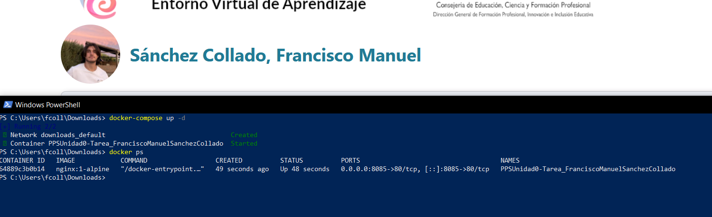
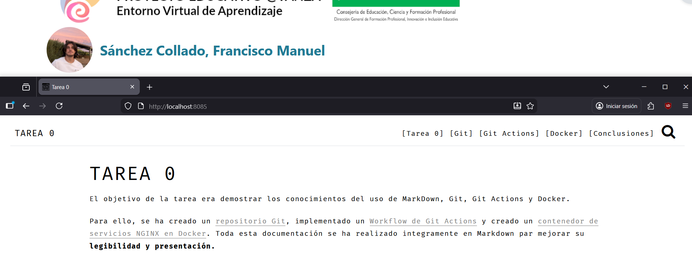

A continuación se va a explicar cómo se crea un contenedor *Docker* de *NGINX*.

## Creación del volumen
Para que el contenedor pueda persistir datos y servir correctamente la documentación, hay que crear un volumen con el workspace con la documentación. 

Para esto, haremos checkout de la rama principal a la generada por la documentación.

> Como truco, para evitar perder documentos que aún no estén terminados y por lo tanto no querramos subir al repositorio, podemos hacer stash (pila) para almacenar los cambios y cuando hayamos acabado en la otra rama, hacer unstash (desapilar) para recopilar los archivos guardados.

Una vez en la rama con el código HTML generado para la documentación, crearemos el archivos docker-compose.yml con las siguientes propiedades:

- image: la imagen que se usará para el contenedor, en este caso la versión reducida de NGINX llamada Alpine
- ports: el mapeo de los puertos, en este caso se mapea el puerto 80 al 8085, lo que permite acceder por el puerto 8085 al NGINX
- container_name: nombre del contenedor
- volumes: la configuración del volumen para que el servidor pueda acceder a los ficheros generados por mkdocs

> ¡Importante! Antes de continuar modifica la ruta del volumen del docker-compose por la ruta a la carpeta en la que esté el repositorio en tu equipo.

Con el archivo preparado, ejecutamos en esa carpeta el comando `docker-compose up -d` para levantar el contenedor desde el compose en modo demonio:

Para comprobar que el contenedor se ha levantado correctamente, ejecutamos el comando `docker ps`:

Con el contenedor funcionando, podremos ver nuestra documentación en la página *http://localhost:8085*

Finalmente, cuando hayamos acabado con el contenedor, podremos desmontarlo con el comando `docker-compose down -v` y además eliminará el volumen que creó dentro del contenedor por el parámetro -v.

