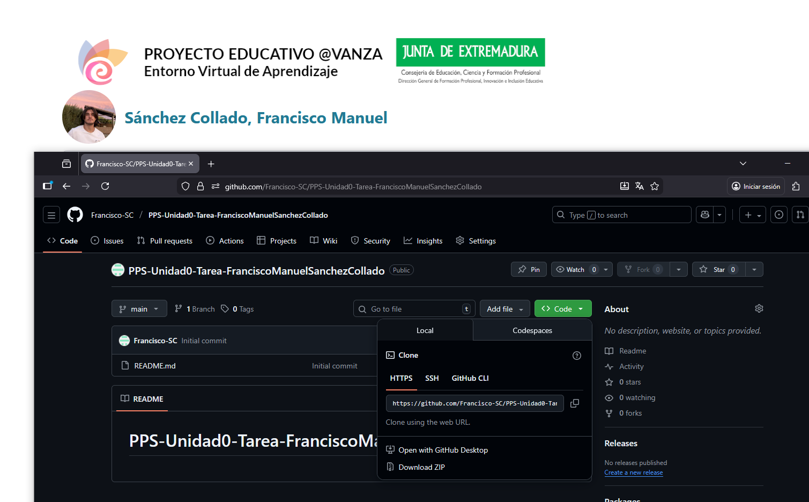
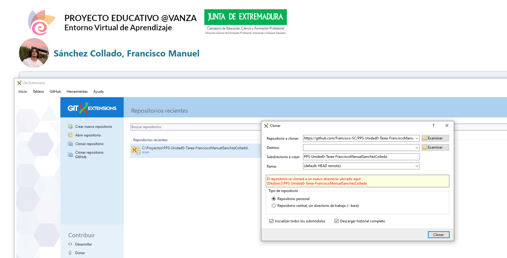

A continuación, se detallan los pasos seguidos para la creación de este proyecto y su sistema de carpetas.

> Importante: Por efectividad y al ya conocerse el funcionamiento de Git, este proyecto se ha creado mediante interfaz gráfica.

## Creación del repositorio

El repositorio se ha creado mediante el botón de "New" de la página [GitHub](https://github.com/):

Una vez creado, se ha clonado a local mediante el enlace *HTTPS* en el botón "Code":

Una vez conseguido el enlace, lo clonamos en local con la herramienta [Git Extensions](https://gitextensions.github.io/)

Una vez con el repositorio en local, se pueden crear la estructura de carpetas y archivos mediante el explorador de archivos de Windows.